# **RentByOwner Travel Assistant Documentation**  
This travel assistant provides **exclusive** lodging recommendations from **[RentByOwner.com](https://www.rentbyowner.com)**. The system fetches accommodation listings, formats them into a structured output, and enhances user experience with travel insights.

---

## What It Does!!!

1. **Exclusive Lodging Options:**  Curated vacation rentals, cabins, condos, villas, and more from [Rent By Owner](https://www.rentbyowner.com).  

2. **Tailored Travel Advice:**  Insights on destinations, attractions, dining, and experiences based on your interests.  

3. **Budget Tips & Price Comparison:**  Optimize your travel expenses and suggest affordable lodging options.  

4. **Real-Time Listings:**  Live property data for the most up-to-date and accurate recommendations.

---

## Why Rent By Owner?

**Millions of Listings**  
  - Featuring rentals in 154,000+ destinations worldwide.
  

 **Variety of Stays**  
  - From luxury villas to pet-friendly cottages and budget apartments.

 **Verified Properties**  
  - Listings from trusted owners and major travel networks.
---

    <b>Thank You</b> for being with 
    <a href="https://www.rentbyowner.com" target="_blank"><b>RentByOwner</b></a>.

